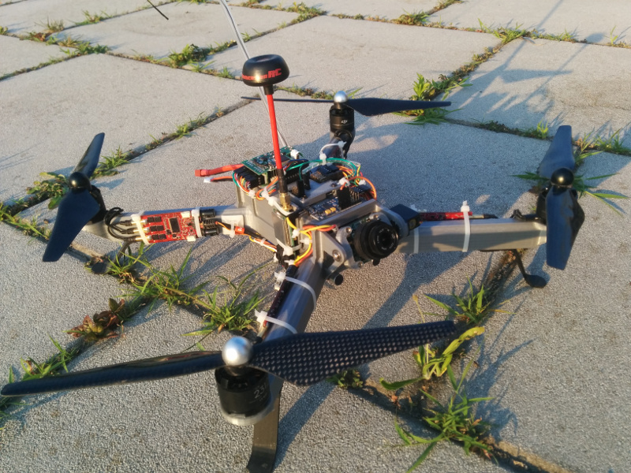

# Unibody FPV quad

A size class 400 FPV quadcopter assembled over a single piece FDM printable body. Some highlights:

* Good FPV flight performances for its class due to high frame rigidity (comparable to frames made from single carbon fiber sheets) and relatively low inertia moment
* servo-operated tiltable FPV CCD camera mount with 180° mechanical range.
* Frame has dedicated fixing points for video TX, ESC, cables, antenna,...
* BOM and exploded diagram of the project with all components and screws located, for easy assembly. 
* Printable & easly replaceable landing gears
* Optional RX antenna guard lets you use those old FM/PCM transmitters working at 35-72 Mhz.

## Stats

* Typical flight time is 18-20 minutes with a 4200 mAh 4s battery. 
* Weight is 250g for the frame alone, ~800g for the assembled quad without battery and ~1250g with a 4200 mAh 4s lipo battery
* Inertia moments around CoG are 1.07,0.98,1.82 Kg/dm^2 (pitch,roll,yaw)
* Battery bay size=50x38x120 mm

Due to the frame size, you'll need a bigger-than-average printer with a minimum build envelope of 320x300x50mm to print the body.

CAD/CAM used for this project is Creo V.2.

## Documentation

[Modal analysis](docs/modal_analysis.md)

[Print instructions](docs/print_instructions.md)

[Exploded diagram with BOM](https://github.com/rb1205/unibody_fpv_quad/raw/master/docs/assembly.pdf)

[Wiring diagram](https://github.com/rb1205/unibody_fpv_quad/raw/master/docs/wiring_diagram.pdf)

[Flight controller PID settings](docs/fc_settings.md) (valid only for the powertrain configuration listed in the BOM)

---

This project is released under the terms of [Creative Commons Attribution-NonCommercial license](https://creativecommons.org/licenses/by-nc/4.0/)

Please contact us at info@inova-soluzioni.it to discuss commercial usage of this project.
