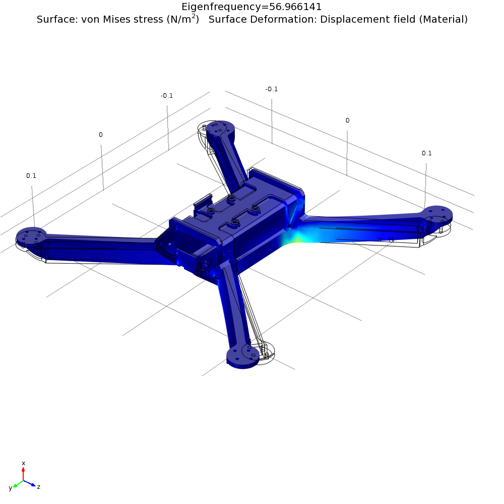
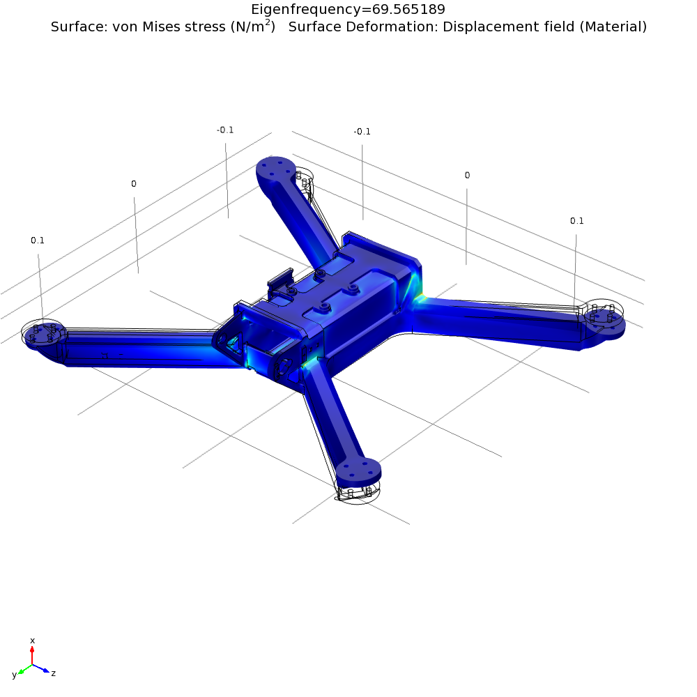

# Modal analysis

To estimate the structure's resonating frequencies, an undamped modal analysis has been performed on a quick-and-dirty FEM model of the body with the added mass from the various mounted devices on the relevant places (namely motors+props, battery, top side electronics, PDB, camera subassembly) and a distributed additional body mass to reach the actual total weight. 

The body is supposed to be printed with commercial grade PLA. Material properties have been taken from [here](http://www.makeitfrom.com/material-properties/Polylactic-Acid-PLA-Polylactide/). As the quad arms are a shell filled with light support structure, as a conservative approach the model has the arms completely hollowed on the inside leaving the solid width and height from the reccomanded print settings (3x0.6mm perimeters, 9x0.2 top and bottom layers).

Following figure shows the meshed model

Analysis has been performed using Comsol Multiphysics V4.1

## Results

The following figures show the first 3 real eigenfrequencies with the relative modal shapes.

The first free body resonation happens at about 56 Hertz and is caused by the arms vibrating on the fixing point on the central box, planarly on the horizontal plane. The second and third frequencies are similar and happen at around 68 hertz, and are due to the arms vibrating out of the horizontal plane.

