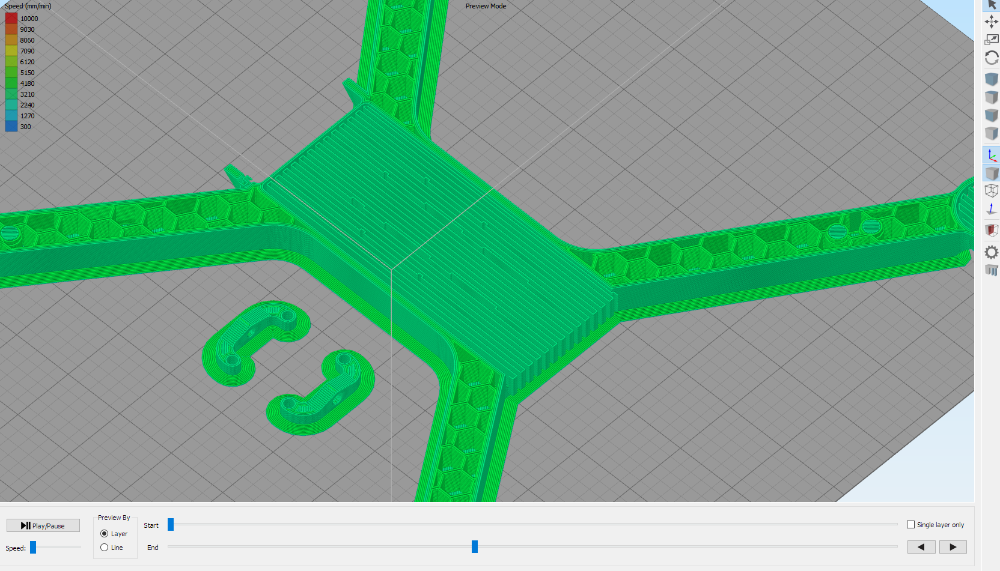

### Body

To print this part you'll need a printer with a minimum printing envelope of 320x300x50mm.

Please observe the following print parameter carefully. The frame has been designed and verified with these settings, using different parameters may alter basilar charateristics like strength, rigidity, stress concetration points, inertia charateristics....

* Material: PLA 
* Nozzle: 0.5mm
* Extrusion width: 0.6mm
* Perimeter outlines: 3
* Layer height: 10mm
* Top solid layers: 9
* Bottom solid layers: 9
* Infill pattern: honeycomb

You are free to set all the remaining printing options as they best suit your printer.

##### Support

You'll need support structures to print the motor support pads, the cutouts near the camera mount and the top of the battery box, and expecially the latter may become hard to remove. To make it simple, set your slicer to build the support parallel to the lateral walls, so that you can extract it by pulling from the open end. The following figure shows what the preview should look like (slicer: simplify3d).

Make sure the slicer is not placing any support in the antenna passage!

### Landing gears

Material: ABS (far better flexibility and shock resistance than PLA)

You're free to print this part as you wish as long as the resulting part is completely solid. You'll need 4 of these.

### Camera Frame

Material: PLA

You're free to print this part as you wish as long as the resulting part is completely solid.

### naze32cover

You're free to print this part as you wish.
